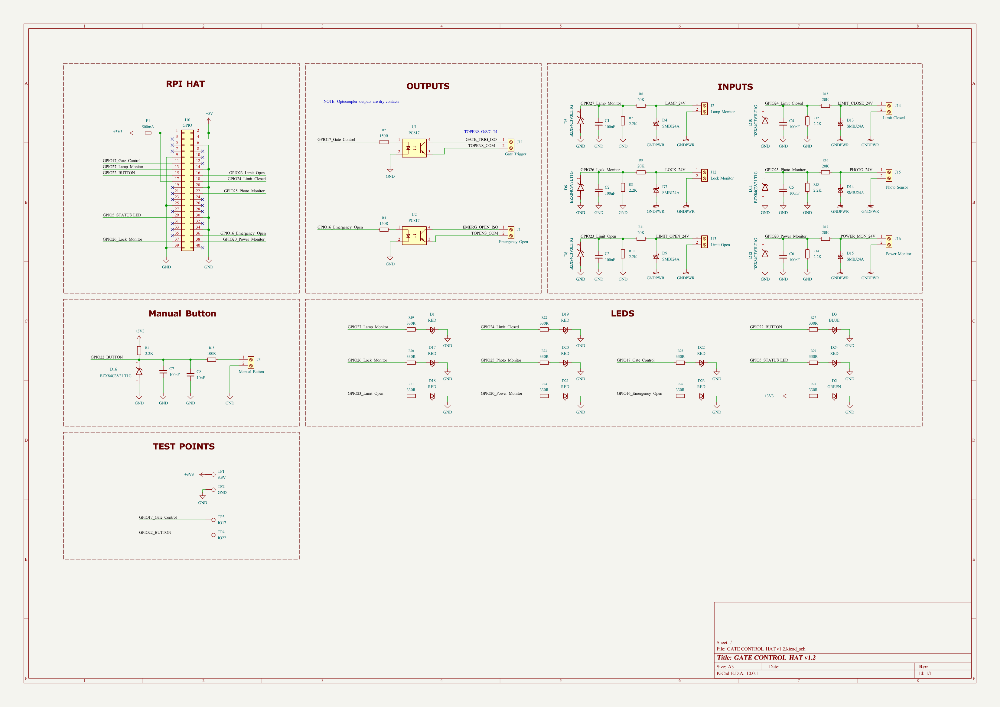
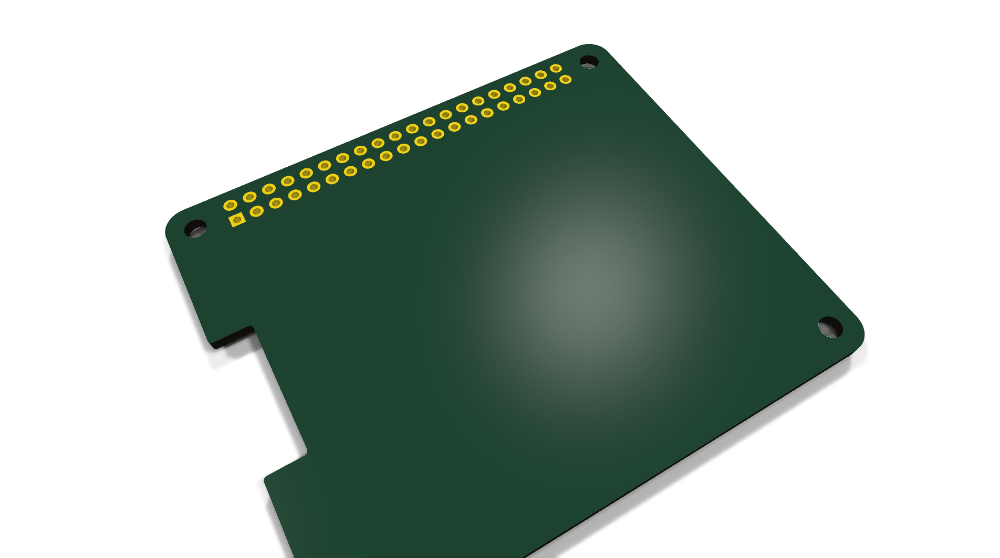
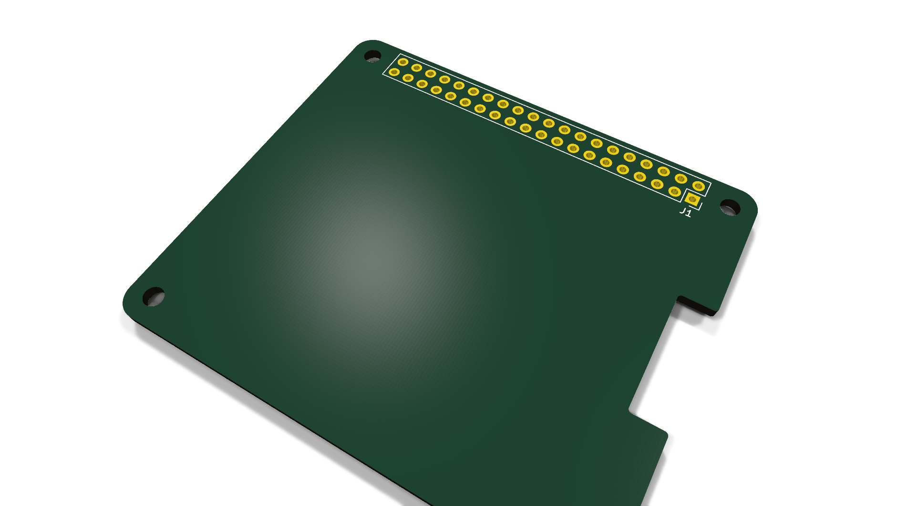

# GATE CONTROL HAT v1.2

Raspberry Pi HAT for gate control with PC817 optocoupler-isolated power / lock monitoring inputs (v1.2)

## At a Glance

- **Status**: In progress
- **Board size**: 65 x 56 mm
- **Layers**: 2
- **Components**: 5
- **Key ICs**:
  - U1,U2: PC817

## Schematic

Full PDF: [reports/schematic.pdf](reports/schematic.pdf)

## Component Roles

- **40-pin RPi GPIO header** (Conn_02x20) - stacks onto a Raspberry Pi as a HAT
- **PC817** optocouplers (multiple) - galvanic isolation for the field-side inputs (Power Monitor + Lock Monitor); protects the Pi from voltage spikes on long field cables
- **SMBJ24A** - 24 V TVS diode for surge protection on the field input lines
- **BZX84C3V3LT1G** - 3.3 V zener for input clamp/reference
- **Screw terminals** for field wiring (gate sensors, lock contacts)
- **500 mA fuse** for input protection
- Status LEDs (Green) to indicate input state at a glance during commissioning

## PCB

**Top copper**

**Bottom copper**

## Bill of Materials

| Refs | Value | Footprint | Qty | MPN | LCSC |
|------|-------|-----------|----:|-----|------|
| C1-C7 | 100nF | Capacitor_SMD:C_0805_2012Metric | 7 |  |  |
| C8 | 10nF | Capacitor_SMD:C_0805_2012Metric | 1 |  |  |
| D1,D17-D24 | RED | LED_SMD:LED_0805_2012Metric | 9 |  |  |
| D2 | GREEN | LED_SMD:LED_0805_2012Metric | 1 |  |  |
| D3 | BLUE | LED_SMD:LED_0805_2012Metric | 1 |  |  |
| D4,D7,D9,D13-D15 | SMBJ24A | Diode_SMD:D_SMB | 6 |  |  |
| D5,D6,D8,D10-D12,D16 | BZX84C3V3LT1G | BZX84C3V3LT1G:SOT95P240X111-3N | 7 |  |  |
| F1 | 500mA | Fuse:Fuse_1206_3216Metric | 1 |  |  |
| J1 | Emergency Open | TerminalBlock_4Ucon:TerminalBlock_4Ucon_1x02_P3.50mm_Vertical | 1 |  |  |
| J2 | Lamp Monitor | TerminalBlock_4Ucon:TerminalBlock_4Ucon_1x02_P3.50mm_Vertical | 1 |  |  |
| J3 | Manual Button | TerminalBlock_4Ucon:TerminalBlock_4Ucon_1x02_P3.50mm_Vertical | 1 |  |  |
| J10 | GPIO | Connector_PinSocket_2.54mm:PinSocket_2x20_P2.54mm_Vertical | 1 |  |  |
| J11 | Gate Trigger | TerminalBlock_4Ucon:TerminalBlock_4Ucon_1x02_P3.50mm_Vertical | 1 |  |  |
| J12 | Lock Monitor | TerminalBlock_4Ucon:TerminalBlock_4Ucon_1x02_P3.50mm_Vertical | 1 |  |  |
| J13 | Limit Open | TerminalBlock_4Ucon:TerminalBlock_4Ucon_1x02_P3.50mm_Vertical | 1 |  |  |
| J14 | Limit Closed | TerminalBlock_4Ucon:TerminalBlock_4Ucon_1x02_P3.50mm_Vertical | 1 |  |  |
| J15 | Photo Sensor | TerminalBlock_4Ucon:TerminalBlock_4Ucon_1x02_P3.50mm_Vertical | 1 |  |  |
| J16 | Power Monitor | TerminalBlock_4Ucon:TerminalBlock_4Ucon_1x02_P3.50mm_Vertical | 1 |  |  |
| R1,R7,R8,R10,R12-R14 | 2.2K | Resistor_SMD:R_0805_2012Metric | 7 |  |  |
| R2,R4 | 150R | Resistor_SMD:R_0805_2012Metric | 2 |  |  |
| R6,R9,R11,R15-R17 | 20K | Resistor_SMD:R_0805_2012Metric | 6 |  |  |
| R18 | 100R | Resistor_SMD:R_0805_2012Metric | 1 |  |  |
| R19-R29 | 330R | Resistor_SMD:R_0805_2012Metric | 11 |  |  |
| U1,U2 | PC817 | Package_DIP:DIP-4_W7.62mm_SMDSocket_SmallPads | 2 |  |  |

_24 of 24 line items don't have an LCSC code in the schematic - search [LCSC](https://www.lcsc.com/) or [JLC parts search](https://jlcsearch.tscircuit.com/) by MPN or footprint when sourcing._

## Files

- `GATE CONTROL HAT v1.2.kicad_pro` - KiCad project
- `GATE CONTROL HAT v1.2.kicad_sch` - schematic source
- `GATE CONTROL HAT v1.2.kicad_pcb` - PCB layout source
- `reports/schematic.pdf` - full schematic (printable)
- `reports/bom.csv` - bill of materials
- `reports/pcb-top.svg`, `reports/pcb-bottom.svg` - copper artwork
- `reports/board-stats.json` - KiCad-generated board statistics

---

_Renders and metadata auto-generated by `Backup-KiCadProject.ps1` using KiCad 10.0._

